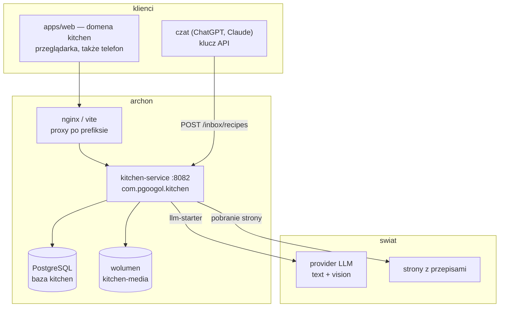
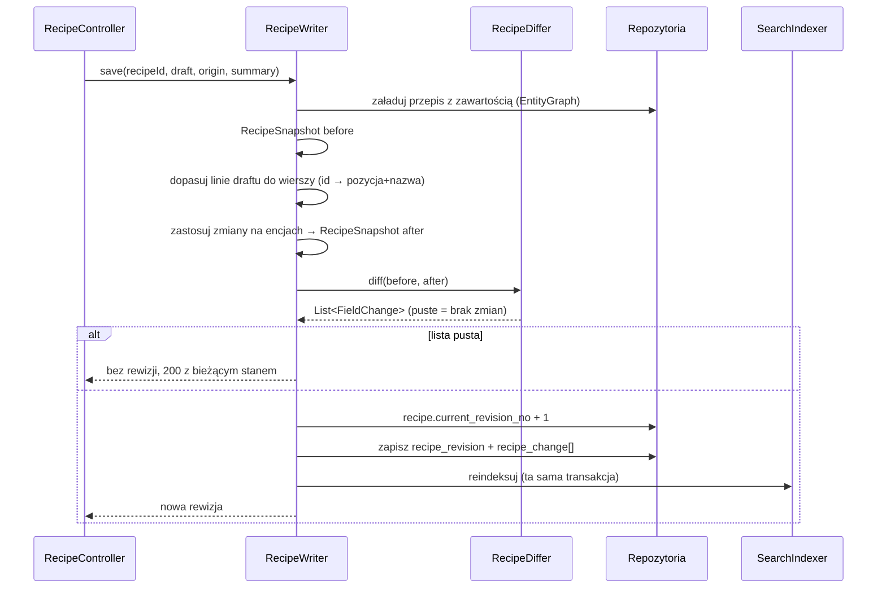
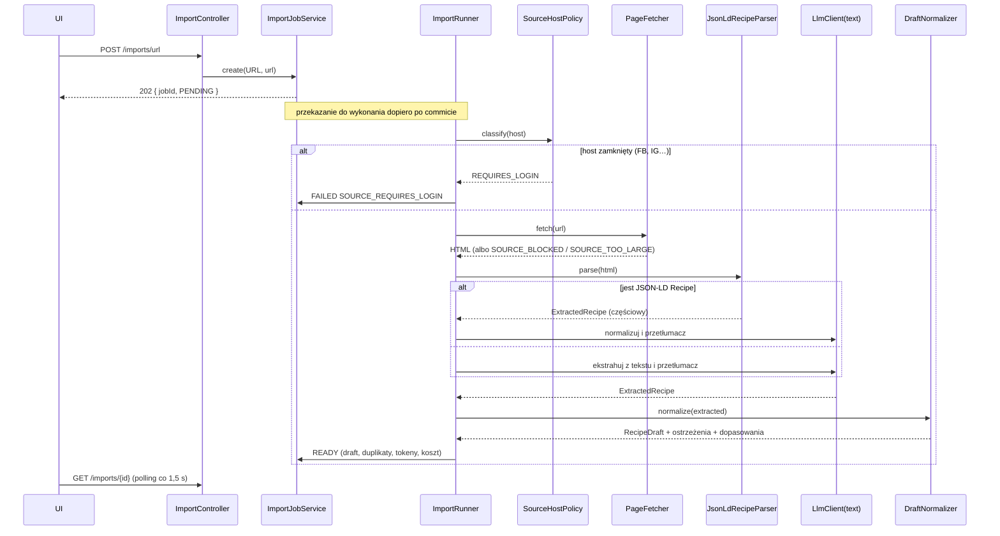
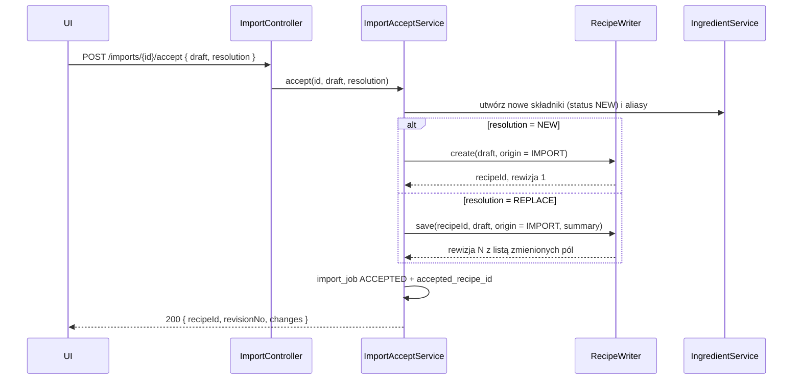
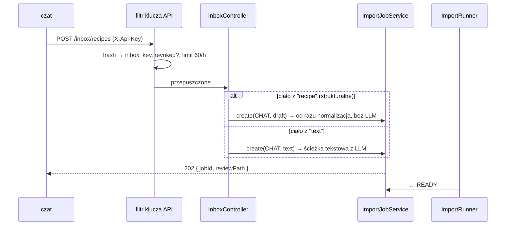

# Architektura kitchen-service

> Jak zbudowana jest aplikacja: moduły, warstwy, kierunki zależności, przepływy,
> silnik rewizji, warstwa LLM, transakcje, błędy, testy, front.
> Co i dlaczego: [KONCEPT.md](KONCEPT.md). Kolejność prac: [PLAN.md](PLAN.md).

---

## 1. Kontekst



Serwis nie zna żadnego innego serwisu z reaktora (reguła: serwis zależy wyłącznie
od `libs/`). Jedyne zależności wewnętrzne to `logging-starter` i nowy
`llm-starter`.

## 2. Styl i zasady

**Modularny monolit z heksagonalnym rdzeniem** — dokładnie ten układ, który
egzekwuje `ArchitectureTest` w finance-service:

1. **Moduł** to fragment domeny (`recipe`, `imports`, `search`…). Moduły są
   pionowe: każdy ma własne encje, logikę i adapterami sięga na zewnątrz.
2. **Warstwy** wewnątrz modułu: `domain` (encje, wartości, reguły — nie wie
   o niczym na zewnątrz siebie), `application` (przypadki użycia, transakcje,
   orkiestracja), `infrastructure` (repozytoria Spring Data, klienci HTTP,
   dysk). Port wychodzący to interfejs w `domain` albo w `application`,
   implementacja w `infrastructure`.
3. **`api`** jest jedna dla całego serwisu (kontrolery, DTO, mappery) — tak jak
   w music i finance. Nic spoza `api` nie sięga do `api`.
4. **Zależności prowadzą do środka.** `api` → `application` → `domain`;
   `infrastructure` → `domain`. Nigdy odwrotnie.
5. **Logika bez frameworka.** Konwersja jednostek, liczenie różnic, odtwarzanie
   stanu z dziennika i normalizacja szkicu nie znają Springa, JPA ani Jacksona
   — sprawdza się je jak zwykły kod, bez kontekstu i bazy. Pilnuje tego ArchUnit.

### 2.1 Co bierzemy z heksagonu, a czego nie

Heksagon opłaca się tam, gdzie jest logika warta odizolowania od wejścia-wyjścia,
i tam, gdzie wejść-wyjść jest naprawdę kilka. W tym serwisie oba warunki są
spełnione — ale nie w każdym module tak samo:

| Gdzie płaci | Dlaczego |
|---|---|
| `revision` | cofanie zmian i liczenie różnic to czyste funkcje; testy bez bazy chodzą w milisekundach i sprawdzają setki losowych ciągów edycji |
| `imports` | cztery różne wejścia (URL, tekst, pliki, czat) prowadzą do jednego rdzenia; adapter dochodzi bez ruszania rdzenia — kanał e-mail będzie piątym |
| warstwa LLM | dwa providery za jednym interfejsem, plus `FakeLlmClient` w testach — to są trzy realne implementacje jednego portu, nie hipoteza |
| `media` | dysk dziś, obiektowy magazyn kiedyś; jedyne miejsce dotykające `java.nio.file` |
| `dictionary` | konwersja jednostek to arytmetyka; framework byłby tam wyłącznie kosztem |

| Gdzie jest kosztem | Jak to ograniczamy |
|---|---|
| moduły w praktyce CRUD-owe (uwagi, zdjęcia, słowniki) | warstwy zostają dla spójności, ale **bez** dodatkowych interfejsów i mapperów — `application` woła repozytorium wprost |
| encje | **encja JPA jest modelem domenowym**; nie budujemy drugiego modelu „czystego" i mapperów między nimi |
| porty | **interfejs portu tylko wtedy, gdy ma więcej niż jedną implementację** (`MediaStorage`, `LlmClient`) albo gdy domena musi zostać bez frameworka. Repozytorium Spring Data **jest** portem — nie owijamy go własnym interfejsem z adapterem |
| `api` | jedno dla całego serwisu, nie po jednym na moduł — tak jak w music i finance |

Anty-wzorce, których w tym serwisie nie chcemy, bo to one dają heksagonowi złą
sławę: port i adapter na każdą klasę · mapper na każdej granicy · anemiczna
domena, w której cała logika wylądowała w `application` · pełna ceremonia
w module, który ma trzy pola i listę.

Gdyby trzeba było zostawić **jedną** regułę z tego rozdziału, zostaje macierz
z §3 — granice między modułami. Warstwy porządkują plik, granice modułów
decydują o tym, czy za rok da się dołożyć listy zakupów bez przepisywania
przepisów.

## 3. Moduły i granice

| Moduł | Odpowiedzialność | Czego NIE robi |
|---|---|---|
| `recipe` | przepis i jego zawartość, uwagi, zdjęcia; jedyna ścieżka zapisu | nie wie o imporcie ani o LLM |
| `revision` | dziennik zmian: liczenie różnic, zapis rewizji, odtwarzanie stanu, przywracanie | nie zna HTTP ani DTO API |
| `ingredient` | katalog składników, aliasy, dopasowanie, scalanie | nie zna przepisu |
| `dictionary` | jednostki, kuchnie, kategorie, diety, tagi, sprzęt, konwersja jednostek | nie zna przepisu |
| `imports` | zlecenia, pobieranie źródeł, JSON-LD, ekstrakcja LLM, normalizacja szkicu, duplikaty | nie zapisuje przepisu — oddaje `RecipeDraft` do `recipe` |
| `inbox` | klucze API, przyjmowanie przepisów z czatów | nie parsuje niczego sam — deleguje do `imports` |
| `media` | pliki: zapis, normalizacja obrazów, serwowanie | nie wie, czyj jest plik |
| `search` | dokument wyszukiwania, zapytania, facety | nie zapisuje przepisu |
| `common` | wyjątki, kody błędów, teksty komunikatów | — |
| `config` | properties, executor, bezpieczeństwo, OpenAPI | — |

**Macierz zależności** (wiersz może wołać kolumnę):

| ↓ woła → | recipe | revision | ingredient | dictionary | imports | inbox | media | search |
|---|---|---|---|---|---|---|---|---|
| **api** | ✔ | ✔ | ✔ | ✔ | ✔ | ✔ | ✔ | ✔ |
| **recipe** | — | ✔ | ✔ | ✔ | ✘ | ✘ | ✔ | ✔ |
| **revision** | ✘ | — | ✘ | ✘ | ✘ | ✘ | ✘ | ✘ |
| **ingredient** | ✘ | ✘ | — | ✔ | ✘ | ✘ | ✘ | ✘ |
| **dictionary** | ✘ | ✘ | ✘ | — | ✘ | ✘ | ✘ | ✘ |
| **imports** | ✔ | ✘ | ✔ | ✔ | — | ✘ | ✔ | ✔ |
| **inbox** | ✘ | ✘ | ✘ | ✘ | ✔ | — | ✘ | ✘ |
| **media** | ✘ | ✘ | ✘ | ✘ | ✘ | ✘ | — | ✘ |
| **search** | ✘ | ✘ | ✘ | ✔ | ✘ | ✘ | ✘ | — |

Dwie rzeczy warte uwagi: **`revision` nie woła nikogo** (dostaje dane w
argumentach — dlatego da się go testować bez bazy), a **`imports` woła `recipe`,
nie odwrotnie** (przepis nie wie, że istnieje import; gdyby wiedział, każda
zmiana w imporcie ruszałaby rdzeń).

Reguły egzekwowane przez `ArchitectureTest` (wzór: finance):

```java
@Test
@DisplayName("silnik rewizji nie zna Springa, JPA ani bazy")
void revisionEngine_staysFreeOfFrameworks() {

    // given: cofanie zmian i liczenie różnic sprawdza się przez podanie dwóch
    // stanów, a nie przez postawienie kontekstu i zapisanie czegokolwiek
    ArchRule rule = noClasses()
        .that().resideInAPackage(BASE + ".revision.domain..")
        .should().dependOnClassesThat()
        .resideInAnyPackage("org.springframework..", "jakarta.persistence..", "org.hibernate..")
        .because("dziennik zmian ma się dać testować jak zwykły kod");

    // when & then
    rule.check(classesUnderTest);
}
```

Dodatkowo, poza kopią reguł z finance (encje w `domain`, repozytoria
w `infrastructure`, kontrolery w `api`, brak `@Autowired` na polu):

| Reguła | Uzasadnienie |
|---|---|
| nic poza `imports..` i `inbox..` nie zależy od `com.pgoogol.llm..` | LLM jest szczegółem importu, nie sposobem pracy całego serwisu |
| `recipe..` nie zależy od `imports..` | kierunek: import wie o przepisie, przepis o imporcie nie |
| `dictionary.domain..` (konwersja jednostek) bez frameworków | tabela przeliczeń to arytmetyka |
| nic poza `media.infrastructure..` nie sięga po `java.nio.file` | jedyne miejsce, które dotyka dysku |

## 4. Warstwy w module — przykład `recipe`

```
recipe/
├─ domain/          Recipe, RecipeIngredient, RecipeStep, RecipePhoto, RecipeNote (encje JPA),
│                   RecipeSnapshot (odczepiony stan), RecipeStatus, Difficulty
├─ application/     RecipeService (odczyt), RecipeWriter (jedyny zapis),
│                   RecipeNoteService, RecipePhotoService
└─ infrastructure/  RecipeRepository, RecipeIngredientRepository, RecipeStepRepository, …
```

- **Encja JPA jest modelem domenowym** (jak w finance) — nie budujemy drugiego,
  „czystego" modelu obok. Wyjątek: `RecipeSnapshot` i wszystko w `revision.domain`
  to zwykłe rekordy, bo pracują poza sesją Hibernate.
- **`RecipeWriter` to jedyna klasa, która zapisuje przepis.** Formularz, akceptacja
  szkicu, „zastąp" z importu i przywrócenie wersji wchodzą tym samym wejściem.
- Odczyt listy i szczegółu idzie przez projekcje i `@EntityGraph`; encje ładujemy
  tylko wtedy, gdy zapisujemy.

## 5. Silnik rewizji (`revision`) — sedno R18

### 5.1 Model w kodzie

```java
/** Odczepiony stan przepisu — wejście i wyjście silnika, nigdy encja JPA. */
public record RecipeSnapshot(
    RecipeHeader header,
    List<IngredientLine> ingredients,
    List<StepLine> steps,
    Set<Long> tagIds,
    Set<Long> dietIds) {

}

public record FieldChange(
    ChangeTarget target,
    ChangeOperation operation,
    String field,
    String oldValue,
    String newValue,
    String removedRow) {

}

public record ChangeTarget(TargetType type, Long id, String label) {

}

public enum ChangeOperation { ADD, UPDATE, REMOVE, MOVE }
```

Trzy klasy bezstanowe, wszystkie bez frameworka:

| Klasa | Sygnatura | Rola |
|---|---|---|
| `RecipeDiffer` | `List<FieldChange> diff(RecipeSnapshot before, RecipeSnapshot after)` | co się zmieniło między dwoma stanami |
| `RevisionReplayer` | `RecipeSnapshot rewind(RecipeSnapshot head, List<FieldChange> changes)` | cofnięcie zmian → stan sprzed nich |
| `ChangeSummarizer` | `List<FieldChange> collapse(List<FieldChange> changes)` | zsumowanie zakresu rewizji do jednej listy (do różnic) |

### 5.2 Zapis rewizji



Wszystko w jednej transakcji: zmiana treści, dziennik i indeks wyszukiwania albo
wchodzą razem, albo wcale.

### 5.3 Dopasowanie linii przy zapisie
Bez tego dziennik pokazywałby „usunięto 8 składników, dodano 8 składników" po
każdej edycji.

| Wejście | Dopasowanie |
|---|---|
| formularz (`RecipeDraft` z `id` linii) | po `id` — jednoznacznie |
| import „zastąp" (bez `id`) | 1) po znormalizowanej `display_name`; 2) reszta po pozycji; 3) niedopasowane = `ADD`/`REMOVE` |
| przywrócenie wersji | po `id` — odtworzony stan niesie oryginalne identyfikatory |

Przestawienie kolejności to `MOVE` na polu `position`, nie `REMOVE` + `ADD`.

### 5.4 Odczyt starej wersji

```java
public RecipeSnapshot at(long recipeId, int revisionNo) {

    RecipeSnapshot head = snapshots.head(recipeId);
    List<FieldChange> newer = changes.after(recipeId, revisionNo);
    return replayer.rewind(head, newer);
}
```

`changes.after` zwraca zmiany z rewizji **nowszych niż** `revisionNo`,
posortowane malejąco. `rewind` cofa je po kolei wg tabeli z KONCEPT §7.2.

### 5.5 Niezmienniki (pilnowane testami)
1. `rewind(head, wszystkie zmiany) ` = stan z rewizji 1.
2. `diff(a, b)` na dwóch odtworzonych stanach = `collapse(zmiany z (a, b])` —
   dwie drogi do tej samej różnicy muszą się zgadzać (test własnościowy na
   losowych ciągach edycji).
3. Zapis bez faktycznej zmiany **nie tworzy** rewizji.
4. `restore(n)` po `restore(n)` nie tworzy drugiej rewizji (stan już jest ten sam).

## 6. Warstwa LLM — `libs/java/llm-starter`

Starter jest wspólny dla całego repo (R11) i nie zna kuchni. Kontrakt:

```java
public interface LlmClient {

    LlmResponse complete(LlmRequest request);

    <T> LlmExtraction<T> extract(LlmRequest request, JsonSchema schema, Class<T> type);
}

public record LlmRequest(String system, List<LlmMessage> messages, LlmOptions options) { }
public record LlmMessage(Role role, List<ContentPart> parts) { }
public sealed interface ContentPart permits TextPart, ImagePart { }
public record ImagePart(byte[] bytes, String mediaType) implements ContentPart { }
public record LlmOptions(Integer maxTokens, Effort effort, Double temperature) { }
public record LlmUsage(long inputTokens, long outputTokens, long cacheReadTokens, long cacheWriteTokens) { }
```

| Element | Rozstrzygnięcie |
|---|---|
| Providery | `anthropic` (`/v1/messages`) i `openai`-zgodny (`/v1/chat/completions`); obrazy jako base64 / data-URI |
| Wyjście strukturalne | `output_config.format` (Anthropic) / `response_format` ze `strict` (OpenAI) — schemat z zasobu, nie z kodu |
| `temperature` | wysyłana **tylko** gdy jawnie ustawiona — nowsze modele odrzucają ten parametr błędem 400 |
| Prompty | `PromptRepository.load("recipe-extraction", "v1")` czyta `llm/<nazwa>/<wersja>/{system.md,user.md,schema.json}` z classpath |
| Nazwane klienty | `llm.clients.text`, `llm.clients.vision`; `LlmClients.client("vision")`; brak klienta o tej nazwie = błąd przy starcie |
| Brak klucza | start przechodzi, pierwsze użycie rzuca `LlmNotConfiguredException` (serwis bez klucza działa „bez importu") |
| Limity | limiter `requests-per-second`, retry 429/5xx/timeout z `Retry-After` (3 próby, 1 s → 8 s), brak retry dla 4xx |
| Rozliczenie | `LlmUsageListener` (SPI) — kuchnia dopisuje tokeny do bieżącego `import_job`; starter sam nie zna encji |
| Wyjątki | `LlmNotConfigured`, `LlmRateLimited`, `LlmUnavailable`, `LlmRequestRejected`, `LlmResponse`, `LlmUnsupportedInput` — serwis mapuje je na swoje kody |
| Testy | `FakeLlmClient` (skryptowane odpowiedzi + rejestr żądań) i `LlmWireMock` (stuby obu providerów) |

Music-service pozostaje na własnym kliencie (R11); notatka o migracji trafia do
jego `DECYZJE.md`.

## 7. Przepływy

### 7.1 Import z linku



### 7.2 Akceptacja szkicu



Odpowiedź niesie listę zmian — po ponownym imporcie od razu widać, co się
zmieniło względem tego, co było.

### 7.3 Przyjęcie z czatu



## 8. Transakcje, współbieżność, wydajność

| Zagadnienie | Rozstrzygnięcie |
|---|---|
| Granica transakcji | metoda `application` (`RecipeWriter.save`, `ImportAcceptService.accept`), nigdy kontroler |
| Zapis przepisu | treść + rewizja + dziennik + indeks wyszukiwania w **jednej** transakcji |
| Współbieżna edycja | `@Version` na `recipe`; unikalność `(recipe_id, revision_no)` jako druga linia obrony; kolizja → `409 RECIPE_MODIFIED` |
| Start zlecenia | `TransactionSynchronization.afterCommit` — nigdy nie przetwarzamy rekordu sprzed commitu |
| Równoległość importów | wątki wirtualne + semafor `kitchen.imports.max-concurrent` (domyślnie 2) — limit kosztu i rate limitu providera |
| Przerwane zlecenia | `RUNNING` po starcie → `FAILED/IMPORT_INTERRUPTED`; ponowienie ręczne (żeby nie zapłacić za LLM drugi raz bez wiedzy użytkownika) |
| Długie żądania | pobieranie strony i LLM **poza** wątkiem żądania; kontroler odpowiada `202` |
| N+1 | `@EntityGraph` na odczycie przepisu (składniki, kroki, powiązania); listy przez projekcje |
| Wyszukiwanie | natywne SQL na `recipe_search`, paginacja offsetowa (dziesiątki–setki przepisów, nie miliony) |
| Pliki | strumieniowanie z dysku, `ETag` = sha256, bez ładowania do pamięci |
| Pula połączeń | Hikari: 10 połączeń, `connection-timeout` 3 s, `leak-detection-threshold` 5 s |

## 9. Błędy

Hierarchia zgodna z regułą serwisów: `AppException` → `NotFoundException`,
`ValidationException`, `ConflictException`, `ForbiddenException`,
`ExternalServiceException`, `RateLimitedException`. Kody w jednym
`ErrorCodes`, teksty w `ExceptionMessageConstants`.

| Kod | Kiedy | Status |
|---|---|---|
| `RECIPE_NOT_FOUND`, `REVISION_NOT_FOUND`, `IMPORT_JOB_NOT_FOUND` | brak zasobu | 404 |
| `RECIPE_MODIFIED` | równoległa edycja (`@Version`) | 409 |
| `IMPORT_NOT_READY` | akceptacja szkicu w stanie innym niż `READY` | 409 |
| `SOURCE_REQUIRES_LOGIN` | host z listy zamkniętych (R26) | 422 |
| `SOURCE_BLOCKED`, `SOURCE_UNREACHABLE`, `SOURCE_TOO_LARGE`, `SOURCE_NOT_HTML` | pobieranie strony | 422 |
| `EXTRACTION_EMPTY`, `EXTRACTION_INVALID` | LLM nie zwrócił użytecznego przepisu | 422 |
| `UNSUPPORTED_MEDIA` | plik niewspieranego typu (po sygnaturze) | 400 |
| `LLM_UNAVAILABLE`, `LLM_RATE_LIMITED`, `LLM_NOT_CONFIGURED` | mapowanie wyjątków startera | 502 / 429 / 503 |
| `INVALID_API_KEY`, `INBOX_RATE_LIMITED` | kanał czatów | 401 / 429 |

Błędy zleceń nie lecą jako wyjątek do klienta — lądują w `import_job.error_code`
i wracają przy odpytywaniu statusu.

## 10. Front — `apps/web/src/features/kitchen`

```
features/kitchen/
├─ index.ts              manifest (jedyny publiczny byt domeny)
├─ api.ts                wywołania HTTP, typy wyłącznie z @archon/api-client/kitchen
├─ state/                KitchenWorkspace (filtry wyszukiwarki, licznik szkiców)
├─ hooks/                useImportJob (polling), useRecipeDraft (edytor)
├─ routes/               PrzepisyRoute, PrzepisRoute, EdycjaRoute, ImportRoute,
│                        SzkicRoute, SkladnikiRoute, KluczeRoute
├─ components/           RecipeDraftEditor (wspólny dla edycji i szkicu),
│                        IngredientRows, StepRows, RevisionTimeline, ChangeList,
│                        SourcePreview, PhotoGallery, FilterPanel
└─ format.ts             ilości, zakresy, czasy, jednostki
```

| Trasa | Ekran |
|---|---|
| `''` | Przepisy — pole „szukaj po wszystkim", panel filtrów z facetami, lista kart |
| `przepis?id=` | Przepis: składniki w grupach (przełącznik „pokaż oryginał"), kroki z czasem i temperaturą, zdjęcia, uwagi, oś historii |
| `edycja?id=` | Formularz `RecipeDraft` — ten sam komponent, którego używa ekran szkicu |
| `import` | Zakładki link / tekst / zdjęcia i PDF; „Szkice do przejrzenia"; historia zleceń |
| `szkic?id=` | Szkic: ostrzeżenia, dopasowania składników, duplikaty (nowy/zastąp), edytor obok podglądu źródła |
| `skladniki` | Katalog: filtr `NEW`, aliasy, scalanie, niedopasowane linie |
| `klucze` | Klucze kanału czatów |

Zasady: manifest jako jedyny eksport domeny, trasy przez `lazy()`, ścieżki
względne wobec `basePath`, identyfikatory w query (`?id=`) — powłoka rozpoznaje
`#/<domena>/<ekran>?<parametry>` i nie wymaga zmian. Ekrany `import` i `szkic`
projektowane mobile-first (R10). `RecipeDraftEditor` jest jeden dla trzech
zastosowań (nowy przepis, edycja, poprawka szkicu) — inaczej trzy formularze
rozjadą się w walidacji.

## 11. Testy

| Poziom | Co | Narzędzia |
|---|---|---|
| Jednostkowe bez frameworka | `UnitConverter`, `RecipeDiffer`, `RevisionReplayer`, `ChangeSummarizer`, `JsonLdRecipeParser`, `SourceHostPolicy`, normalizacja szkicu | JUnit 5, AssertJ, `@ParameterizedTest` |
| Własnościowe | losowy ciąg 20 edycji → cofnięcie do rewizji 1 = stan początkowy; `diff` dwiema drogami | JUnit 5 z generatorem w teście |
| Repozytoria i migracje | schemat na czystej bazie, zapytania wyszukiwarki, unikalności | Testcontainers (Postgres 16) |
| Klienci HTTP | `PageFetcher` (403, redirect na adres prywatny, limit rozmiaru), providery LLM | WireMock |
| LLM w scenariuszach | ścieżki importu bez sieci | `FakeLlmClient` ze startera |
| Integracyjne API | import → szkic → akceptacja → historia → wyszukiwanie; bezpieczeństwo inbox | `@SpringBootTest` + MockMvc + Testcontainers |
| Kontrakt | kod vs `contracts/openapi/kitchen.yaml` | `OpenApiContractTest` (wzór z finance) |
| Architektura | reguły z §3 | ArchUnit |
| Front | edytor szkicu, polling, filtry | Vitest + Testing Library + MSW |

## 12. Warianty odrzucone

| Wariant | Dlaczego nie |
|---|---|
| **Kopia całego przepisu na każdą wersję** | odrzucone decyzją R18: historia ma mówić, co się zmieniło; kopie odpowiadają tylko na „jak wtedy wyglądało" i rosną liniowo z liczbą edycji |
| **Pełne event sourcing** (stan wyłącznie z dziennika) | każdy odczyt przepisu wymagałby odtworzenia; przy narzędziu domowym to koszt bez zysku. Bierzemy połowę: stan bieżący normalnie, dziennik obok |
| **Spring Batch do importów** | job = jedno wywołanie LLM na przepis; restartowalność chunków rozwiązuje problem, którego nie mamy. Music używa Batcha, bo tam job to 2500 utworów |
| **Osobny serwis na przepisy i osobny na zakupy** | serwis nie może zależeć od serwisu, a lista zakupów czyta składniki przepisów — rozdział wymusiłby API między nimi. Jeden serwis `kitchen`, moduły w środku |
| **Sekcje przepisu jako encja** | KONCEPT §4.3 — etykieta na wierszu robi to samo bez dodatkowego poziomu |
| **MinIO/S3 od początku** | jeden użytkownik, jeden host; port `MediaStorage` zostawia miejsce na adapter, gdy będzie potrzebny |
| **Pobieranie Facebooka i Instagrama przez scraper** | wymaga obchodzenia logowania; zamiast tego jawna lista zamkniętych hostów i ścieżka zrzut/tekst (R26) |
| **LLM liczy jednostki i skalowanie** | każda liczba z modelu to liczba do sprawdzenia; przeliczenia są deterministyczne, więc należą do kodu (R5) |
| **Wspólny klient LLM przez skopiowanie kodu z music** | kopia rozjeżdża się przy pierwszej poprawce; starter w `libs/java` to reguła repo (R11) |

## 13. Mapa katalogów

```
libs/java/llm-starter/
└─ src/main/java/com/pgoogol/llm/
   ├─ LlmClient, LlmRequest, LlmResponse, LlmExtraction, LlmUsage, ContentPart…
   ├─ prompt/      PromptRepository, PromptTemplate
   ├─ provider/    AnthropicLlmClient, OpenAiCompatibleLlmClient
   ├─ config/      LlmProperties, LlmClients, LlmAutoConfiguration, CostEstimator
   └─ test/        FakeLlmClient, LlmWireMock

services/kitchen-service/
├─ docs/           KONCEPT.md, ARCHITEKTURA.md, PLAN.md, KANAL_CZATOW.md (M8)
└─ src/main/
   ├─ java/com/pgoogol/kitchen/
   │  ├─ KitchenServiceApplication.java
   │  ├─ api/            kontrolery, DTO (Request/Response), mappery, GlobalExceptionHandler
   │  ├─ recipe/         domain | application | infrastructure
   │  ├─ revision/       domain (RecipeDiffer, RevisionReplayer, ChangeSummarizer, FieldChange)
   │  │                  application (RevisionService) | infrastructure (repozytoria)
   │  ├─ ingredient/     domain | application (IngredientResolver, merge) | infrastructure
   │  ├─ dictionary/     domain (UnitConverter, kody) | application | infrastructure
   │  ├─ imports/        domain (ImportJob, ExtractedRecipe, RecipeDraft)
   │  │                  application (ImportJobService, ImportRunner, ImportAcceptService)
   │  │                  infrastructure (PageFetcher, SourceHostPolicy, JsonLdRecipeParser,
   │  │                                  RecipeExtractor, VisionRecipeExtractor, DraftNormalizer)
   │  ├─ inbox/          domain | application (InboxKeyService) | infrastructure
   │  ├─ media/          domain | application (MediaFileService, ImageNormalizer)
   │  │                  infrastructure (FileSystemMediaStorage)
   │  ├─ search/         domain (RecipeSearchCriteria) | application (indexer) | infrastructure (SQL)
   │  ├─ common/         AppException i pochodne, ErrorCodes, ExceptionMessageConstants
   │  └─ config/         KitchenProperties, ImportExecutorConfig, SecurityConfig, OpenApiConfig
   └─ resources/
      ├─ application.yml, application-local.yml
      ├─ db/migration/   V1__rozszerzenia.sql, V2__schemat.sql, V3__zlecenia_importu.sql,
      │                  V4__wyszukiwanie.sql, V5__klucze_inbox.sql
      └─ llm/recipe-extraction/v1/{system.md,user.md,schema.json}
         llm/recipe-normalize/v1/…
```
