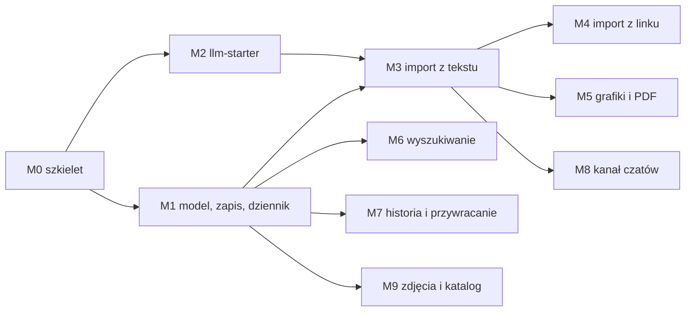

# Plan pracy — kitchen-service

Podstawa: [KONCEPT.md](KONCEPT.md) (rozstrzygnięcia R1–R27) i
[ARCHITEKTURA.md](ARCHITEKTURA.md). Zasada jak w music: **jedna sesja Claude Code
= jeden kamień milowy**, każdy kończy się działającym, testowalnym przyrostem,
który da się pokazać w przeglądarce.

> **Kolejność kamieni jest propozycją** (R27) — zależności między nimi są twarde,
> reszta jest do przestawienia.

Twarde zależności: M1 blokuje wszystko poza M2; M2 blokuje importy; M3 buduje
ścieżkę szkiców, na której stoją M4, M5 i M8. M6, M7 i M9 zależą wyłącznie od M1.

**Dlaczego tekst przed linkiem:** z czterech realnych przykładów (KONCEPT §5.9)
dwa to posty z Facebooka i Instagrama, których nie da się pobrać po stronie
serwera. Ścieżka „wklej tekst / zrób zrzut ekranu" jest podstawowa, nie awaryjna.

---

## M0 — Szkielet serwisu i infrastruktura ✅

**Cel:** pusty, ale kompletny serwis w monorepo: buduje się, wstaje w compose,
ma prefiks w proxy, kontrakt, generowane typy i domenę widoczną we froncie.

**Zrobione 2026-09-08.** Ustalenia i odstępstwa: sekcja na końcu tego pliku.

| # | Zadanie |
|---|---|
| 0.1 | Moduł `services/kitchen-service` (pom bez wersji, `KitchenServiceApplication`, `application.yml` z portem 8082 i `ddl-auto: validate`, `application-local.yml` z `spring.config.import` `.env`, `Dockerfile` wg wzoru music); `ArchitectureTest` z regułami z ARCHITEKTURA §3, `TestcontainersConfiguration` |
| 0.2 | Migracja `V1__rozszerzenia.sql` (`pg_trgm`, `unaccent`) — żeby Flyway i Testcontainers przeszły przez CI, zanim powstanie schemat |
| 0.3 | `contracts/openapi/kitchen.yaml` — nagłówek, serwery, tagi, `GET /kitchen/api/v1/dictionaries` (puste listy), żeby test kontraktu i generator miały co porównywać |
| 0.4 | `libs/ts/api-client`: `kitchen.generated.ts`, `kitchen.ts`, eksport `./kitchen`, skrypt `generate` |
| 0.5 | Compose: serwis `kitchen-service` (profile `kitchen`/`services`/`full`), baza w `10-bazy-serwisow.sql`, wolumen `kitchen-media`, `web` z `KITCHEN_API_*`; `nginx.conf.template` (location + `client_max_body_size 100m`), `vite.config.ts`, `apps/web/Dockerfile`; `URUCHAMIANIE.md` |
| 0.6 | `.env.example`: blok `KITCHEN_LLM_*` i `KITCHEN_LLM_VISION_*`, puste wartości |
| 0.7 | Front: `features/kitchen/` z manifestem (`id: 'kitchen'`, `title: 'kuchnia'`), `KitchenWorkspaceProvider`, jedna trasa `''`; linia w `registry/index.ts` |
| 0.8 | Sprawdzenie na wąskim ekranie (375 px), czy powłoka nadaje się pod ekran importu z telefonu — wynik w sekcji „Ustalenia z M0"; ewentualna wada powłoki zgłoszona osobno, nie obchodzona lokalnie |

**DoD:** `./mvnw -pl services/kitchen-service -am verify` zielone;
`pnpm lint && pnpm typecheck && pnpm test && pnpm build` zielone;
`docker compose --profile kitchen --profile web up` — `/actuator/health` UP,
front pokazuje domenę „kuchnia" i woła `/kitchen/api/v1/dictionaries` przez proxy;
CI zielone na czystym klonie.

---

## M1 — Model, jedyna ścieżka zapisu, dziennik zmian ✅ *(blokuje resztę)*

**Zrobione 2026-09-09.** Testy integracyjne (Testcontainers) czekają na CI —
w sesji nie było Dockera.

**Cel:** zamrożony schemat z KONCEPT §4; przepis da się założyć ręcznie, obejrzeć
i zmienić, a każda zmiana zostawia ślad w dzienniku (R18).

| # | Zadanie |
|---|---|
| 1.1 | `V2__schemat.sql`: tabele z §4 (razem z `recipe_revision` i `recipe_change`), indeksy z §4.1, słowniki startowe z §4.2 |
| 1.2 | Encje JPA w `*/domain`, repozytoria w `*/infrastructure`, `LAZY` na asocjacjach, `@Version` na `recipe` i `ingredient` |
| 1.3 | `RecipeDraft` (DTO wspólne — R24) z Bean Validation, z opcjonalnymi `id` linii; `RecipeSnapshot` |
| 1.4 | `revision.domain`: `FieldChange`, `RecipeDiffer` (dopasowanie linii wg ARCHITEKTURA §5.3), `ChangeSummarizer` — bez Springa i JPA |
| 1.5 | `RecipeWriter` — jedyna ścieżka zapisu: załaduj → zastosuj draft → policz różnicę → zapisz rewizję i zmiany; brak zmian = brak rewizji; `@Version` → `409 RECIPE_MODIFIED` |
| 1.6 | `RecipeService` (odczyt z `@EntityGraph`, lista po dacie), `RecipeNoteService`, `IngredientResolver` + `IngredientService`, `UnitConverter` z tabelą z §5.6 |
| 1.7 | Kontrakt i API: `POST/GET/PUT/DELETE /recipes`, uwagi, słowniki, składniki (`GET`, `POST`, aliasy); `ErrorCodes` |
| 1.8 | Front: lista przepisów, widok przepisu (grupy składników, „pokaż oryginał", kroki z czasem i temperaturą, uwagi), `RecipeDraftEditor` (nowy przepis i edycja) z podpowiedziami z katalogu |

**DoD:** migracje wstają na czystej bazie; testy `UnitConverter` i `RecipeDiffer`
zielone (w tym: zmiana ilości = jeden `UPDATE`, przestawienie kolejności =
`MOVE`, usunięcie = `REMOVE` z zapamiętanym wierszem); test integracyjny:
przepis z 2 grupami składników, alternatywą i 4 krokami → odczyt identyczny;
edycja jednego pola tworzy rewizję z **jedną** zmianą; zapis bez zmian nie
tworzy rewizji; formularz we froncie zakłada i edytuje przepis.
**Schemat zatwierdzony przed M3.**

---

## M2 — `llm-starter` ✅ *(równolegle z M1)*

**Zrobione 2026-09-09.** Ustalenia i odstępstwa: sekcja na końcu tego pliku.

**Cel:** starter z ARCHITEKTURA §6 gotowy do użycia, bez dotykania music-service.

| # | Zadanie |
|---|---|
| 2.1 | Moduł `libs/java/llm-starter` w reactorze i `dependencyManagement`; API, wyjątki, `PromptRepository` |
| 2.2 | `AnthropicLlmClient` i `OpenAiCompatibleLlmClient`: obrazy, wyjście wg schematu JSON, effort, brak `temperature` bez jawnego ustawienia, mapowanie powodów zatrzymania, zużycie tokenów |
| 2.3 | Limiter, ponowienia z `Retry-After`, timeouty, maskowanie nagłówków z kluczem |
| 2.4 | `LlmProperties` z nazwanymi klientami, `LlmClients`, `LlmAutoConfiguration`, `LlmUsageListener`, `CostEstimator` |
| 2.5 | `FakeLlmClient` i `LlmWireMock` (sukces z JSON, 429 z `Retry-After`, 500, odpowiedź obcięta, żądanie z obrazem) |
| 2.6 | Testy: auto-konfiguracja (`ApplicationContextRunner`), oba providery na WireMock, ponowienia, parsowanie ekstrakcji do rekordu |
| 2.7 | Aktualizacja D40 w `services/music-service/docs/DECYZJE.md` o to, co przy budowie startera wyszło inaczej niż w notatce — bez zmian w kodzie music |

**DoD:** `./mvnw -pl libs/java/llm-starter verify` zielone z pokryciem wg reguł;
aplikacja testowa w `src/test` wysyła tekst + obraz i dostaje rekord zgodny ze
schematem; `git diff --stat` na music-service pokazuje wyłącznie plik `DECYZJE.md`
(notatka D40 stoi tam od etapu planowania — M2 co najwyżej ją prostuje).

---

## M3 — Import z tekstu i szkice *(po M1, M2)*

**Cel:** wklejony tekst zamienia się w szkic, szkic w przepis — ścieżka, na której
staną wszystkie pozostałe źródła.

| # | Zadanie |
|---|---|
| 3.1 | `V3__zlecenia_importu.sql`: `import_job`, `recipe_source`, indeksy |
| 3.2 | `ImportJobService` (tworzenie, statusy, `retry`, oznaczanie przerwanych po starcie), `ImportRunner` uruchamiany po commicie, `ImportExecutorConfig` (wątki wirtualne + semafor) |
| 3.3 | Prompt `llm/recipe-extraction/v1/` + `RecipeExtractor` (klient `text`) → `ExtractedRecipe` |
| 3.4 | `DraftNormalizer`: jednostki, składniki, słowniki, walidacje, ostrzeżenia → `RecipeDraft` + meta |
| 3.5 | `DuplicateFinder` po tytule (trgm) |
| 3.6 | `LlmUsageListener` zapisujący model, wersję promptu, tokeny i koszt do zlecenia |
| 3.7 | Endpointy: `POST /imports/text`, `GET /imports`, `GET /imports/{id}`, `accept` (NEW/REPLACE przez `RecipeWriter`), `reject`, `retry`; kontrakt |
| 3.8 | Front: zakładka „Tekst" z oczekiwaniem w miejscu (`useImportJob`), lista „Szkice do przejrzenia", ekran `szkic` (ostrzeżenia, dopasowania składników, duplikaty, `RecipeDraftEditor` obok podglądu źródła) |

**DoD:** zestaw ≥10 przepisów w różnych formatach — w tym treść posta
z Facebooka i podpis z Instagrama z KONCEPT §5.9 wklejone jako tekst, przepis po
angielsku z `cups`/`°F`, przepis z zakresami („2–3 jajka") i bez ilości („do
smaku") — daje szkice z poprawnymi ilościami, jednostkami polskimi i
`source_text` przy każdej linii; akceptacja „zastąp" pokazuje listę zmienionych
pól; testy integracyjne na `FakeLlmClient` (ścieżka szczęśliwa, pusta ekstrakcja,
błąd providera, ponowienie); `kill` w trakcie zlecenia → `FAILED/IMPORT_INTERRUPTED`
i działające `retry`; zamknięcie karty nie gubi szkicu.

---

## M4 — Import z linku *(po M3)*

**Cel:** wklejony URL → szkic; JSON-LD bez LLM tam, gdzie się da; zamknięte
serwisy odbite od razu z sensownym komunikatem.

| # | Zadanie |
|---|---|
| 4.1 | `SourceHostPolicy` (R26): lista hostów wymagających logowania (facebook, instagram, tiktok, pinterest) → `SOURCE_REQUIRES_LOGIN` bez pobierania i bez LLM |
| 4.2 | `PageFetcher` z limitami i strażą SSRF + wykrycie ściany logowania po pobraniu |
| 4.3 | `JsonLdRecipeParser` (jsoup, `@graph`, `HowToSection`, ISO 8601 duration, `recipeYield` w formach „4", „4 porcje", „serves 4–6") |
| 4.4 | Ścieżka „normalizuj i przetłumacz" dla JSON-LD (prompt `recipe-normalize/v1`) oraz fallback HTML → tekst → ekstrakcja z M3 |
| 4.5 | `recipe_source` z URL, `url_normalized` (bez parametrów śledzących), `site_name`, `author`, `json_ld`, `raw_text`; duplikaty po URL |
| 4.6 | Endpoint `POST /imports/url`; front: zakładka „Link", podgląd źródła w szkicu |

**DoD:** przykłady z KONCEPT §5.9 przechodzą zgodnie z tabelą: Jamie Oliver →
JSON-LD albo czytelny `SOURCE_BLOCKED` z podpowiedzią; `kolorowygarnek.wordpress.com`
→ ekstrakcja z tekstu z rozbiciem narracji na kroki; Facebook i Instagram →
`SOURCE_REQUIRES_LOGIN` **bez** wywołania LLM (asercja na `FakeLlmClient`);
adres z `?utm_*` i bez rozpoznawany jako ten sam duplikat; testy SSRF
(`127.0.0.1`, `10.0.0.1`, przekierowanie na adres prywatny) — odrzucone;
parser na zapisanych stronach w `src/test/resources`.

---

## M5 — Import z grafik i PDF *(po M3)*

**Cel:** zdjęcie z telefonu, skan zeszytu, zrzut ekranu z Instagrama lub PDF →
szkic; oryginały zachowane.

| # | Zadanie |
|---|---|
| 5.1 | `MediaStorage` (port) + `FileSystemMediaStorage`, `MediaFileService`, `GET /media/{id}` z `ETag` i `nosniff` |
| 5.2 | `ImageNormalizer`: sygnatury plików, HEIC → JPEG (libheif w `Dockerfile`), PDF → PNG per strona (PDFBox), skalowanie do 1568 px, JPEG 85; zapis oryginału i wersji znormalizowanej |
| 5.3 | `VisionRecipeExtractor` (klient `vision`, wiele obrazów w jednym żądaniu, ten sam schemat wyjścia) |
| 5.4 | `POST /imports/files` (multipart, limity z konfiguracji, typ po sygnaturze); kontrakt |
| 5.5 | Front: zakładka „Zdjęcia i PDF" z `capture="environment"`, miniatury przed wysyłką, pasek postępu; w szkicu obrazy źródła obok edytora (na telefonie przełącznik) |
| 5.6 | Test obrazu Dockera: konwersja próbki HEIC w kontenerze |

**DoD:** cztery próbki — zdjęcie wydrukowanego przepisu, zdjęcie odręcznego
zeszytu, zrzut ekranu z Instagrama (przykład z §5.9), dwustronicowy PDF — dają
szkice z sensowną strukturą; HEIC z iPhone'a przechodzi w compose; upload 5 zdjęć
po ~8 MB przechodzi przez nginx; oryginały widoczne pod `/media/{id}`.

---

## M6 — Wyszukiwanie i filtry *(po M1)*

**Cel:** jedno pole „po wszystkim" i panel filtrów z facetami (KONCEPT §8).

| # | Zadanie |
|---|---|
| 6.1 | `V4__wyszukiwanie.sql`: `recipe_search`, indeksy GIN (tsvector, trgm) |
| 6.2 | `RecipeSearchIndexer` — dokument z wagami, wywoływany w transakcji zapisu; przeliczenie istniejących przepisów przy starcie, gdy tabela pusta |
| 6.3 | `RecipeSearchRepository` (natywne SQL: `tsquery` + trgm + filtry słownikowe + składniki AND + czas), sortowania, paginacja z limitem 100 |
| 6.4 | `GET /recipes` z parametrami, `GET /recipes/facets`; kontrakt |
| 6.5 | Front: pole globalne z debounce, panel filtrów z facetami, stan w hashu, chipy aktywnych filtrów |

**DoD:** testy integracyjne na ~30 przepisach: `q=cukini` znajduje „cukinia",
`q=pomidorowa` trafia po tytule i po składniku,
`ingredient=kurczak&ingredient=cukinia` = tylko przepisy z oboma; facety zgadzają
się z liczbą wyników; wyszukanie na 1000 wygenerowanych przepisach poniżej 100 ms
na Testcontainers.

---

## M7 — Historia, różnice, przywracanie *(po M1)*

**Cel:** druga połowa silnika rewizji — odczyt przeszłości (zapis powstał w M1).

| # | Zadanie |
|---|---|
| 7.1 | `RevisionReplayer` (cofanie zmian wg KONCEPT §7.2) + `RevisionService.at(recipeId, revisionNo)` |
| 7.2 | `GET /recipes/{id}/revisions`, `GET …/{no}` (odtworzony stan), `GET …/{a}/diff/{b}` (przez `ChangeSummarizer`), `POST …/{no}/restore` (różnica → nowa rewizja z `origin = RESTORE`) |
| 7.3 | `changeSummary`: wymagany przy edycji z formularza, automatyczny przy `REPLACE` z importu i przy `restore` |
| 7.4 | Front: oś historii w widoku przepisu — lista rewizji z opisem i liczbą zmian, podgląd dowolnej wersji, porównanie dwóch, „przywróć" |

**DoD:** testy własnościowe z ARCHITEKTURA §5.5 (cofnięcie wszystkich zmian =
stan z rewizji 1; `diff` liczony dwiema drogami daje to samo); przywrócenie
rewizji 1 po trzech edycjach daje rewizję 5 o treści identycznej z 1, a historia
zachowuje wszystkie kroki; UI pokazuje różnice bez przeładowania.

---

## M8 — Kanał z czatów *(po M3)*

**Cel:** czat wysyła przepis kluczem API, przepis ląduje jako szkic (KONCEPT §6).

| # | Zadanie |
|---|---|
| 8.1 | `V5__klucze_inbox.sql`: `inbox_key`, `import_job.inbox_key_id` |
| 8.2 | Spring Security: `SecurityFilterChain` tylko dla `/kitchen/api/v1/inbox/recipes` z filtrem klucza; drugi łańcuch `permitAll` z komentarzem „do czasu uwierzytelniania"; nagłówki bezpieczeństwa |
| 8.3 | `InboxKeyService` (generowanie `ktc_…`, hash, pokazanie raz, unieważnienie), limit 60/h na klucz |
| 8.4 | `POST /inbox/recipes`: `text` → ścieżka M3; `recipe` → normalizacja bez LLM; źródło `CHAT`; odpowiedź 202 z `reviewPath` |
| 8.5 | Kontrakt: `InboundRecipeRequest` (`oneOf`), klucze; front: ekran `klucze` |
| 8.6 | `docs/KANAL_CZATOW.md`: podłączenie (Custom GPT Action, projekt Claude, curl), fragment kontraktu, zasada ekspozycji z §13 |

**DoD:** `curl` z kluczem i strukturalnym JSON-em → szkic `READY` bez wywołania
LLM; z `text` → szkic po ekstrakcji; bez klucza lub z unieważnionym → 401;
61. żądanie w godzinie → 429; klucz nie pojawia się w logach (test na
appenderze); pozostałe endpointy działają jak dotąd.

---

## M9 — Zdjęcia dań i porządkowanie katalogu *(po M1, M5)*

**Cel:** przepis ma zdjęcia, katalog składników da się utrzymać w czystości.

| # | Zadanie |
|---|---|
| 9.1 | `recipe_photo`: upload (normalizacja jak w M5, miniatura), kolejność, podpis, usunięcie; propozycja pobrania `image` z JSON-LD przy akceptacji szkicu z linku |
| 9.2 | `IngredientService.mergeInto`: przepięcie użyć i aliasów, `merged_into_id`, status `VERIFIED` |
| 9.3 | `GET /ingredients?status=NEW`, `PATCH`, lista „niedopasowane w przepisach" z przypisaniem |
| 9.4 | Front: galeria w widoku przepisu (upload z telefonu), ekran `skladniki` (aliasy, scalanie z podglądem „w ilu przepisach", niedopasowane linie) |

**DoD:** scalenie „cebule" → „cebula" przepina wszystkie użycia i zostawia alias;
test na współbieżne scalanie (`@Version`); zdjęcie z telefonu w widoku przepisu
w compose.

---

## Po M9 — backlog (KONCEPT §15)

Sposób wystawienia serwisu (R21) · uwierzytelnianie i `owner_id` · skalowanie
porcji · lista zakupów · spiżarnia · plan posiłków · wartości odżywcze ·
podprzepisy · przerabianie przez LLM · kanał e-mail · sprzątanie plików
odrzuconych szkiców · eksport PDF/JSON.

## Ustalenia z M0

**Powłoka na wąskim ekranie (zadanie 0.8) — nadaje się, bez zmian w `shell/`.**
Pomiar w Chromium na zbudowanym froncie: przy 375 × 812 i 768 × 1024 `scrollWidth`
równa się szerokości okna, żaden element nie wystaje poza widok, przyciski domen
i zakładek zawijają się do kolejnych wierszy. Jedyna uwaga na przyszłość:
nagłówek zjada na telefonie **222 px, czyli 27% wysokości ekranu** (nazwa domeny,
podpis zawijający się do czterech wierszy, dwa rzędy przycisków). Dla listy
przepisów to bez znaczenia, ale ekran importu ze zdjęciami (M5) ma być obsługiwany
kciukiem — wtedy trzeba wrócić do tematu i zgłosić to jako wadę powłoki, jeśli
podpis i nawigacja nadal będą zajmować tyle miejsca. Dziś to nie blokuje niczego.

**Testy integracyjne nie mają jak się uruchomić w tej sesji — Docker jest
niedostępny.** Testcontainers nie wstanie, więc `KitchenServiceApplicationTests`
(migracje na czystej bazie) czeka na CI. Test kontraktu udało się mimo to
uruchomić i **przechodzi**: kontekst wstaje bez bazy po wyłączeniu autokonfiguracji
`DataSource`, JPA, Hibernate i Flyway (`SPRING_AUTOCONFIGURE_EXCLUDE` +
`TEST_POSTGRES_CONTAINER=false`), a to wystarcza, żeby springdoc wygenerował
specyfikację. Ręcznie pisany `contracts/openapi/kitchen.yaml` zgadza się z kodem
we wszystkich czterech wymiarach (operacje, parametry, pola schematów, enumy).

**Odstępstwa i decyzje drobne, które wyszły przy pisaniu:**

- **Schemat `kitchen` w bazie `kitchen`** — wzorem finance (`default_schema`
  + `flyway.schemas`), a nie wzorem music, który siedzi w `public`. Nazwa schematu
  jest w konfiguracji, więc encje jej nie noszą.
- **`V1__rozszerzenia.sql` zakłada rozszerzenia w schemacie `public`**, mimo że
  tabele pójdą do `kitchen`: funkcje `similarity` i `unaccent` mają się rozwiązywać
  bez kwalifikowania nazwą schematu.
- **Dockerfile'e music i finance dostały `COPY services/kitchen-service/pom.xml`.**
  Maven czyta całą listę modułów z root POM-u, zanim zawęzi build do `-pl`, więc
  bez tego wiersza obrazy pozostałych serwisów przestałyby się budować. To samo
  będzie dotyczyć każdego kolejnego modułu — także `llm-startera` w M2.
- **Reguły ArchUnita na moduły, których jeszcze nie ma** (`recipe`, `revision`,
  `media`, encje, repozytoria) mają `allowEmptyShould(true)`. Zaczną gryźć w chwili,
  gdy pakiet powstanie, zamiast wywalać build za to, że jeszcze go nie ma.
- **Ekran „Przepisy" pobiera słowniki** (dziś puste listy) i pokazuje błąd, gdy
  serwis nie odpowiada. To celowo pierwsza droga end-to-end: kontrakt → typy TS →
  zapytanie → kontekst domeny → ekran. Trzy testy frontu pilnują pustego stanu,
  komunikatu o błędzie i wczytania słowników przez dostawcę domeny.
- **`docker-compose.kitchen-on-host.yml`** powstał od razu, dla symetrii
  z pozostałymi serwisami — bez niego front w kontenerze nie trafiłby do kuchni
  uruchomionej na hoście.

## Ustalenia z M2

**Kształt `output_config` u Anthropic jest spisany z dokumentacji, nie sprawdzony
na żywym koncie.** Dotyczy schematu wyjścia i `effort` — w tej sesji nie było ani
klucza, ani wyjścia do sieci. Oba pola serializują się wyłącznie przy ekstrakcji
albo jawnym `effort`, więc zwykłe uzupełnienie tekstu jest tym niezagrożone:
żądanie bez schematu wygląda tak samo jak przed dołożeniem tych pól. Pierwsze
prawdziwe wywołanie w M3 to zweryfikuje. Ta sama uwaga jest w D40 music-service
i w ARCHITEKTURA §6, żeby nie wyszła dopiero z błędu 400.

**Trzy Dockerfile'y dostały `COPY libs/java/llm-starter/pom.xml`** — dokładnie to,
co zapowiadały ustalenia z M0: Maven czyta całą listę modułów z roota, zanim zawęzi
build do `-pl`. Formalnie oznacza to, że `git diff` na music-service pokazuje dwa
pliki, nie jeden (`DECYZJE.md` i `Dockerfile`), ale **kod music-service jest
nietknięty** — a bez tego wiersza obraz tego serwisu przestałby się budować.

**Odstępstwa od kontraktu z ARCHITEKTURA §6:**

- **`LlmClient` ma `name()`.** Bez tego ani zdarzenie zużycia, ani komunikat błędu
  nie mówią, który z nazwanych klientów zapłacił albo odmówił.
- **Sprawdzenie nazwanych klientów przy starcie jest jawne** — `llm.required-clients`.
  Starter nie zgadnie, o którą nazwę serwis poprosi w kodzie, więc lista musi paść
  z konfiguracji; bez niej brak wpisu wyszedłby dopiero przy pierwszym imporcie.
- **`max_completion_tokens` u providerów zgodnych z OpenAI**, nie `max_tokens` —
  modele rozumujące odrzucają dawną nazwę.
- **Tokeny z cache liczone osobno.** U providerów zgodnych z OpenAI `prompt_tokens`
  zawiera już `cached_tokens`, więc odejmujemy je, żeby nie policzyć dwa razy.
- **`LlmWireMock` został w testach startera** (`LlmWireMockStubs`), a nie w jarze.
  Stuby badają kształt żądania providera, czyli rzecz wewnętrzną dla startera;
  serwisowi do testów wystarcza `FakeLlmClient`, który jest w `com.pgoogol.llm.test`
  w kodzie głównym. Gdyby kuchnia potrzebowała stubów providera, przeniesienie jest
  wtedy świadomą decyzją, a nie zapasem na wszelki wypadek.
- **Prompty podstawiają zmienne** — `Prompt.user(mapa)` z `{{nazwa}}`. Brak wartości
  jest błędem, nie pustym napisem: prompt z dziurą to zapytanie, za które płacimy,
  a odpowiedź i tak jest o czymś innym.
- **`CostEstimator` dopasowuje cennik po najdłuższym przedrostku nazwy modelu**
  i zwraca pusty wynik, gdy nie zna modelu. Zero w raporcie wyglądałoby jak
  darmowe zapytanie.
- **Klucz nie wychodzi poza starter.** Nagłówki w logu mają maskę, a treść błędu
  providera przechodzi przez `SecretMasker`, zanim trafi do komunikatu wyjątku —
  providerzy potrafią odesłać klucz w treści 400, a klucz raz zalogowany jest
  spalony.

**Bramka pokrycia nie mierzy tego modułu.** Reguła JaCoCo celuje w klasy `*Service`,
a starter żadnej takiej nie ma. 67 testów pokrywa oba providery na WireMocku,
auto-konfigurację, limiter, prompty, cennik i ekstrakcję tekst + obraz do rekordu.
