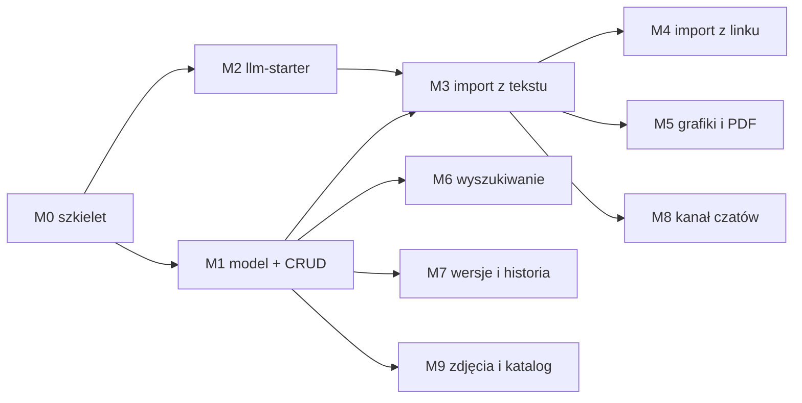

# Plan pracy — recipes-service

Podstawa: [KONCEPT.md](KONCEPT.md) (rozstrzygnięcia R1–R25). Zasada jak w music:
**jedna sesja Claude Code = jeden kamień milowy**, każdy kończy się działającym,
testowalnym przyrostem, który da się pokazać w przeglądarce. Kolejność wynika
z zależności: schemat (M1) blokuje wszystko, starter LLM (M2) blokuje importy
(M3–M5), importy blokują kanał czatów (M8), który jest tylko kolejnym wejściem
do tej samej ścieżki szkiców.

M2 idzie równolegle z M1 (nie zależy od schematu). M6, M7 i M9 nie zależą od
importów i mogą wejść w dowolnej kolejności po M1 — proponowana kolejność
poniżej stawia importy wcześniej, bo to one dają książce treść do przeszukiwania.

---

## M0 — Szkielet serwisu i infrastruktura

**Cel:** pusty, ale kompletny serwis w monorepo: buduje się, wstaje w compose,
ma prefiks w proxy, kontrakt, generowane typy i domenę widoczną we froncie.

| # | Zadanie |
|---|---|
| 0.1 | Moduł `services/recipes-service` (pom bez wersji, `RecipesServiceApplication`, `application.yml` z portem 8082 i `ddl-auto: validate`, `application-local.yml` z `spring.config.import` `.env`, `Dockerfile` wg wzoru music); `ArchitectureTest`, `TestcontainersConfiguration`, `OpenApiContractTest` skopiowane z konwencji |
| 0.2 | Migracja `V1__rozszerzenia.sql` tylko z `pg_trgm` i `unaccent` — żeby Flyway i Testcontainers przeszły przez CI zanim powstanie schemat (schemat właściwy to M1, `V2`) |
| 0.3 | `contracts/openapi/recipes.yaml` — nagłówek, serwery, tagi, jeden endpoint `GET /recipes/api/v1/dictionaries` zwracający puste listy (żeby test kontraktu i generator miały co porównywać) |
| 0.4 | `libs/ts/api-client`: `recipes.generated.ts`, `recipes.ts`, eksport, skrypt `generate` |
| 0.5 | Compose: serwis `recipes-service` (profile `recipes`/`services`/`full`), baza w `10-bazy-serwisow.sql`, wolumen `recipes-media`, `web` z `RECIPES_API_*`; `nginx.conf.template` (location + `client_max_body_size 100m`), `vite.config.ts`, `apps/web/Dockerfile`; `URUCHAMIANIE.md` — profil `recipes` |
| 0.6 | `.env.example`: blok `RECIPES_LLM_*` i `RECIPES_LLM_VISION_*` z komentarzem, puste wartości |
| 0.7 | Front: `features/recipes/` z manifestem, `RecipesWorkspaceProvider`, jedna trasa `''` z pustym ekranem „Przepisy"; linia w `registry/index.ts`; test manifestu jak w pozostałych domenach |
| 0.8 | Sprawdzenie na wąskim ekranie (375 px), czy powłoka nadaje się pod ekran importu z telefonu — wynik zapisany w tym pliku (sekcja „Ustalenia z M0"), ewentualna wada powłoki zgłoszona osobno |

**DoD:** `./mvnw -pl services/recipes-service -am verify` zielone;
`pnpm lint && pnpm typecheck && pnpm test && pnpm build` zielone;
`docker compose --profile recipes --profile web up` — `/actuator/health` UP,
front pokazuje domenę „przepisy" i woła `/recipes/api/v1/dictionaries` przez
proxy; CI zielone na czystym klonie.

---

## M1 — Model danych, słowniki, CRUD przepisu *(blokuje resztę)*

**Cel:** zamrożony schemat z KONCEPT §4, przepis da się założyć ręcznie,
obejrzeć i zaktualizować nową wersją.

| # | Zadanie |
|---|---|
| 1.1 | `V2__schemat_przepisow.sql`: wszystkie tabele z §4, indeksy z §4.1, słowniki startowe z §4.2 (`unit`, `cuisine`, `recipe_category`, `diet`) |
| 1.2 | Encje JPA (`recipe`, `ingredient`, `dictionary`, `media` — bez logiki importu), `LAZY` na asocjacjach, `@Version` na `recipe` i `ingredient` |
| 1.3 | `RecipeDraft` (DTO wspólne — R24) z Bean Validation; `RecipeVersionMapper` draft → encje wersji (składniki, alternatywy, kroki, powiązania krok–składnik, sprzęt, tagi, diety) |
| 1.4 | `RecipeService`: `create(draft)` (wersja 1, źródło `MANUAL`), `get(id)`, `addVersion(id, draft, changeSummary)`, `archive(id)`, `list(page)` (prosta lista po dacie — wyszukiwanie w M6) |
| 1.5 | `IngredientResolver` (alias dokładny → trgm → brak) + `IngredientService` (`create`, `addAlias`); `UnitConverter` z tabelą z §5.6 i testami jednostkowymi na każdej regule |
| 1.6 | `DictionaryService` + `GET /dictionaries`; `RecipeNoteService` + endpointy uwag (R17) |
| 1.7 | Kontrakt: przepisy (bez wyszukiwania), wersje `POST`, uwagi, słowniki, składniki (`GET`, `POST`, aliasy); `ErrorCodes` domeny |
| 1.8 | Front: lista przepisów (kafelki, bez filtrów), widok przepisu (składniki z grupami i „pokaż oryginał", kroki z czasem/temperaturą, uwagi), formularz `RecipeDraft` (nowy / nowa wersja) z dynamicznymi listami składników i kroków, podpowiedzią składników z katalogu i słownikami |

**DoD:** migracje wstają na czystej bazie w Testcontainers; testy repozytoriów
i `UnitConverter` zielone; test integracyjny: utworzenie przepisu z 2 grupami
składników, alternatywą, 4 krokami z powiązaniami → odczyt identyczny; nowa
wersja przestawia głowę, wersja 1 bez zmian; formularz we froncie zakłada
przepis i pokazuje go. **Schemat zatwierdzony przed M3** — od tego momentu
zmiany tylko kolejną migracją.

---

## M2 — `llm-starter` *(równolegle z M1)*

**Cel:** starter z KONCEPT §9 gotowy do użycia przez recipes-service, bez
dotykania music-service.

| # | Zadanie |
|---|---|
| 2.1 | Moduł `libs/java/llm-starter` w reactorze i `dependencyManagement`; API z §9.2, wyjątki, `PromptRepository` (§9.3) |
| 2.2 | `AnthropicLlmClient` i `OpenAiCompatibleLlmClient` (§9.5): obrazy, `json_schema`, effort, brak `temperature` bez jawnego ustawienia, mapowanie `stop_reason`/`finish_reason`, zużycie |
| 2.3 | Limiter, ponowienia z `Retry-After`, timeouty; maskowanie nagłówków z kluczem |
| 2.4 | `LlmProperties` z nazwanymi klientami, `LlmClients`, `LlmAutoConfiguration` (`imports`), `LlmUsageListener`, `CostEstimator` |
| 2.5 | Wsparcie testów: `FakeLlmClient`, `LlmWireMock` ze stubami obu providerów (sukces z JSON, 429 + `Retry-After`, 500, obcięcie `max_tokens`, odpowiedź z obrazem w żądaniu) |
| 2.6 | Testy startera: auto-konfiguracja (`ApplicationContextRunner`: włączony/wyłączony, brak klienta o nazwie = błąd startu, brak klucza = `LlmNotConfiguredException` przy użyciu), oba providery na WireMock, ponowienia, parsowanie ekstrakcji do rekordu |
| 2.7 | Notatka w `services/music-service/docs/DECYZJE.md` (D36) wg §9.9 — bez zmian w kodzie music |

**DoD:** `./mvnw -pl libs/java/llm-starter verify` zielone z pokryciem JaCoCo
jak w regułach; przykładowa aplikacja testowa w `src/test` wysyła tekst
+ obraz i dostaje rekord zgodny ze schematem na stubie; w music-service nic
poza dokumentem się nie zmieniło (`git diff --stat`).

---

## M3 — Import z tekstu i szkice *(po M1, M2)*

**Cel:** wklejony tekst zamienia się w szkic, szkic w przepis — pełna ścieżka
z KONCEPT §5.1, §5.3, §5.5–5.7, na której staną pozostałe źródła.

| # | Zadanie |
|---|---|
| 3.1 | `V3__zlecenia_importu.sql`: `import_job`, `recipe_source` w użyciu, indeksy |
| 3.2 | `ImportJobService` (tworzenie, statusy, `retry`, oznaczanie przerwanych po starcie), `ImportRunner` na executorze po commicie, `ImportExecutorConfig` (2 wątki) |
| 3.3 | Prompt `llm/recipe-extraction/v1/` (system, user, schema) + `RecipeExtractor` (klient `text`) → `ExtractedRecipe` |
| 3.4 | `DraftNormalizer` (§5.6): jednostki przez `UnitConverter`, składniki przez `IngredientResolver`, słowniki, walidacje, ostrzeżenia → `RecipeDraft` + meta |
| 3.5 | `DuplicateFinder` po tytule (trgm) — URL dojdzie w M4 |
| 3.6 | `LlmUsageListener` zapisujący tokeny, model, wersję promptu i koszt do zlecenia |
| 3.7 | Endpointy: `POST /imports/text`, `GET /imports`, `GET /imports/{id}`, `accept` (NEW/REPLACE), `reject`, `retry`; kontrakt |
| 3.8 | Front: zakładka „Tekst" na ekranie `import` z oczekiwaniem w miejscu (`useImportJob`), lista „Szkice do przejrzenia", ekran `szkic` (ostrzeżenia, dopasowania składników do potwierdzenia, kandydaci na duplikat, edytor z M1 obok podglądu tekstu źródła, akceptuj/odrzuć) |

**DoD:** zestaw ≥10 przepisów w różnych formatach (lista, tabela, narracja
z bloga, wiadomość z komunikatora, po angielsku z `cups`/`°F`, po polsku
z ułamkami i zakresami — w tym przykłady od właściciela) → szkice z poprawnymi
ilościami, jednostkami polskimi, `source_text` przy każdej linii; testy
integracyjne na `FakeLlmClient` (ścieżka szczęśliwa, pusta ekstrakcja, błąd
providera, ponowienie); `kill` aplikacji w trakcie zlecenia → po starcie
`FAILED/IMPORT_INTERRUPTED` i działające `retry`; zamknięcie karty w trakcie
importu nie gubi szkicu.

---

## M4 — Import z linku *(po M3)*

**Cel:** wklejony URL → szkic; JSON-LD bez LLM tam, gdzie się da.

| # | Zadanie |
|---|---|
| 4.1 | `PageFetcher` z limitami i strażą SSRF (§5.2) + testy na adresach prywatnych, przekierowaniach, przekroczeniu rozmiaru |
| 4.2 | `JsonLdRecipeParser` (jsoup, `@graph`, `HowToSection`, ISO 8601 duration, `recipeYield` w formach „4", „4 porcje", „serves 4–6") → `ExtractedRecipe` częściowy |
| 4.3 | Ścieżka LLM „normalizuj i przetłumacz" dla JSON-LD (prompt `recipe-normalize/v1`) oraz fallback HTML → tekst → ekstrakcja z M3 |
| 4.4 | `recipe_source` z URL, `url_normalized`, `site_name`, `author`, `json_ld`, `raw_text`; `DuplicateFinder` po URL |
| 4.5 | Błędy: `SOURCE_BLOCKED`, `SOURCE_TOO_LARGE`, `SOURCE_NOT_HTML`, `SOURCE_UNREACHABLE` z komunikatami po polsku |
| 4.6 | Endpoint `POST /imports/url`; front: zakładka „Link", podgląd źródła w szkicu (tytuł strony, autor, link, JSON-LD w rozwijanym bloku) |

**DoD:** 10 adresów z realnych serwisów (polskie blogi z JSON-LD i bez, dwa
zagraniczne z jednostkami imperialnymi) → szkice z poprawną strukturą
i tłumaczeniem; strona zwracająca 403 → czytelny błąd z podpowiedzią; testy
parsera na zapisanych stronach w `src/test/resources`; testy WireMock na
`PageFetcher`; SSRF: `http://127.0.0.1`, `http://10.0.0.1`, przekierowanie
na adres prywatny — wszystkie odrzucone.

---

## M5 — Import z grafik i PDF *(po M3)*

**Cel:** zdjęcie z telefonu, skan zeszytu, zrzut ekranu lub PDF → szkic;
oryginały zachowane.

| # | Zadanie |
|---|---|
| 5.1 | `MediaStorage` (dysk, `recipes.media.root`, `storage_key` = UUID), `MediaFileService`, `GET /media/{id}` z `ETag` i `nosniff` |
| 5.2 | `ImageNormalizer`: sygnatury plików, HEIC → JPEG (libheif w `Dockerfile`), PDF → PNG per strona (PDFBox), skalowanie do 1568 px, JPEG 85; zapis `IMPORT_ORIGINAL` + `IMPORT_NORMALIZED` |
| 5.3 | `VisionRecipeExtractor` (klient `vision`, wiele obrazów w jednym żądaniu, ten sam schemat wyjścia) |
| 5.4 | `POST /imports/files` (multipart, limity z konfiguracji, typ po sygnaturze); kontrakt |
| 5.5 | Front: zakładka „Zdjęcia i PDF" z `capture="environment"`, podgląd miniatur przed wysłaniem, pasek postępu uploadu; ekran szkicu pokazuje obrazy źródła obok edytora (na telefonie: przełącznik źródło/edytor) |
| 5.6 | Test obrazu Dockera: kontener z `libheif` konwertuje próbkę HEIC (plik testowy w repo, kilkadziesiąt KB) |

**DoD:** cztery próbki: zdjęcie wydrukowanego przepisu, zdjęcie odręcznego
zeszytu, zrzut ekranu z Instagrama, dwustronicowy PDF → szkice z sensowną
strukturą; HEIC z iPhone'a przechodzi w compose; upload 5 zdjęć po ~8 MB
przez nginx (limit z M0) działa; testy jednostkowe normalizatora na PNG/JPEG/PDF
z zasobów testowych; oryginały widoczne pod `/media/{id}`.

---

## M6 — Wyszukiwanie i filtry *(po M1)*

**Cel:** jedno pole „po wszystkim" i panel filtrów z facetami (KONCEPT §8).

| # | Zadanie |
|---|---|
| 6.1 | `V4__wyszukiwanie.sql`: `recipe_search`, indeksy GIN (tsvector, trgm) — jeśli nie weszły w V2 |
| 6.2 | `RecipeSearchIndexer` — budowa dokumentu z wagami, wywoływany w transakcji `create`/`addVersion`/`archive`; migracyjne przeliczenie istniejących przepisów przy starcie, gdy tabela pusta |
| 6.3 | `RecipeSearchRepository` (natywne SQL: `tsquery` + trgm + filtry słownikowe + składniki AND + czas), `RecipeSearchCriteria`, sortowania, paginacja z limitem 100 |
| 6.4 | `GET /recipes` z parametrami, `GET /recipes/facets`; kontrakt |
| 6.5 | Front: pole globalne z debounce (`useDebouncedParam`), panel filtrów z facetami (kuchnia, kategoria, dieta, tagi, czas, składniki z podpowiedzią), stan w hashu, chipy aktywnych filtrów |

**DoD:** testy integracyjne na ~30 przepisach: `q=cukini` znajduje „cukinia",
`q=pomidorowa` znajduje po tytule i po składniku, `ingredient=kurczak&ingredient=cukinia`
= tylko przepisy z oboma, filtry łączą się AND między parametrami; facety
zgadzają się z liczbą wyników; wyszukanie na 1000 wygenerowanych przepisów
poniżej 100 ms na Testcontainers.

---

## M7 — Historia wersji, różnice, przywracanie *(po M1)*

**Cel:** pełne wersjonowanie z KONCEPT §7 widoczne w UI.

| # | Zadanie |
|---|---|
| 7.1 | `GET /recipes/{id}/versions`, `GET …/{no}`, `POST …/{no}/restore`; `VersionDiffService` + `GET …/{a}/diff/{b}` (nagłówek, składniki, kroki: dodane/usunięte/zmienione z listą pól) |
| 7.2 | `changeSummary` wymagany przy nowej wersji z formularza (z podpowiedzią „co zmieniłeś?"), automatyczny przy `REPLACE` z importu i przy `restore` |
| 7.3 | Front: zakładka „Historia" w widoku przepisu — lista wersji, podgląd dowolnej, porównanie dwóch (kolorowanie dodane/usunięte/zmienione), przycisk „przywróć" |

**DoD:** testy `VersionDiffService` (zmiana ilości, zamiana kolejności kroków,
usunięcie składnika, zmiana grupy); przywrócenie wersji 1 po trzech edycjach
daje wersję 5 identyczną treścią z 1; UI pokazuje różnice bez przeładowania.

---

## M8 — Kanał z czatów *(po M3)*

**Cel:** czat wysyła przepis kluczem API, przepis ląduje jako szkic
(KONCEPT §6).

| # | Zadanie |
|---|---|
| 8.1 | `V5__klucze_inbox.sql`: `inbox_key`, `import_job.inbox_key_id` |
| 8.2 | Spring Security: `SecurityFilterChain` tylko dla `/recipes/api/v1/inbox/recipes` z filtrem klucza (hash, `revoked_at`, `last_used_at`), CSRF wyłączony wyłącznie dla tego łańcucha (bezstanowe API z kluczem), reszta `permitAll` w drugim łańcuchu z komentarzem „do czasu uwierzytelniania"; nagłówki bezpieczeństwa wg reguł |
| 8.3 | `InboxKeyService` (generowanie `rcp_…`, hash, pokazanie raz, unieważnienie), limit 60/h na klucz |
| 8.4 | `POST /inbox/recipes`: `text` → ścieżka M3; `recipe` (strukturalny) → `DraftNormalizer` bez LLM; źródło `CHAT`; odpowiedź 202 z `reviewPath` |
| 8.5 | Kontrakt: `InboundRecipeRequest` (`oneOf`), klucze; front: ekran `klucze` |
| 8.6 | `docs/KANAL_CZATOW.md`: instrukcja podłączenia (Custom GPT Action, projekt Claude, skrypt curl), fragment kontraktu, zasada ekspozycji z §13 |

**DoD:** `curl` z kluczem i JSON-em strukturalnym → szkic `READY` bez
wywołania LLM (asercja na `FakeLlmClient`); z `text` → szkic po ekstrakcji;
bez klucza / z unieważnionym → 401; 61. żądanie w godzinie → 429; klucz nigdy
nie pojawia się w logach (test na appenderze); pozostałe endpointy działają
bez nagłówka jak dotąd; test integracyjny łańcuchów Security.

---

## M9 — Zdjęcia dań i porządkowanie katalogu składników *(po M1, M5)*

**Cel:** przepis ma zdjęcia, katalog składników da się utrzymać w czystości.

| # | Zadanie |
|---|---|
| 9.1 | `recipe_photo`: upload (multipart, normalizacja jak w M5, miniatura), kolejność, podpis, usunięcie; automatyczne pobranie `image` z JSON-LD przy akceptacji szkicu z linku (za zgodą w szkicu) |
| 9.2 | `IngredientService.mergeInto(source, target)`: przepięcie `recipe_ingredient`, `recipe_ingredient_alternative`, aliasów; `merged_into_id`; status `VERIFIED` |
| 9.3 | `GET /ingredients?status=NEW`, `PATCH` (nazwa, kategoria, jednostka domyślna); lista „niedopasowane w przepisach" (`ingredient_id IS NULL`) z przypisaniem |
| 9.4 | Front: galeria w widoku przepisu (upload z telefonu), ekran `skladniki` (lista, aliasy, scalanie z podglądem „w ilu przepisach", niedopasowane linie) |

**DoD:** scalenie „cebule" → „cebula" przepina wszystkie użycia i zostawia
alias; testy na współbieżne scalanie (`@Version`); zdjęcie z telefonu
w widoku przepisu w compose; szkic z linku proponuje zdjęcie ze strony.

---

## Po M9 — backlog z gotowym miejscem (KONCEPT §15)

Kolejność do ustalenia, gdy książka będzie miała treść: uwierzytelnianie
i `owner_id` · skalowanie porcji · lista zakupów · spiżarnia · plan posiłków ·
wartości odżywcze · przerabianie przez LLM · kanał e-mail · sprzątanie plików
odrzuconych szkiców · eksport PDF/JSON.

## Ustalenia z M0

*(uzupełniane po zakończeniu M0: wynik sprawdzenia responsywności powłoki,
ewentualne odstępstwa od KONCEPT).*
